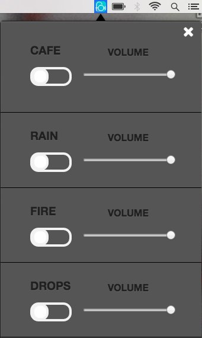

## Foco[](https://travis-ci.org/akashnimare/foco)
[](https://ci.appveyor.com/project/akashnimare/foco/branch/master)
[](https://github.com/feross/standard)

<h1 align="center">
  <br>
  
</h1>

<h4 align="center">A menubar/taskbar Gmail App based on <a href="http://electron.atom.io" target="_blank">Electron</a>.</h4>

Foco is a cross-platform desktop app :computer: which runs in menubar. 
Foco boosts your productivity :rocket: by creating perfect productive environment.
It has the best sounds for getting work done :raised_hands:.

<br>
[](https://www.youtube.com/watch?v=6SG2Mjpv8YE)


## Installation
[FR]: https://github.com/akashnimare/foco/releases

### OS X

1. Download [Foco-osx.x.x.x.dmg][FR] or [Foco-osx.x.x.x.zip][FR]
2. Open or unzip the file and drag the app into the `Applications` folder
3. Done!

### Windows
coming soon :stuck_out_tongue_closed_eyes:

### Linux

*Ubuntu, Debian 8+ (deb package):*

1. Download [Foco-linux.x.x.x.deb][FR]
2. Double click and install, or run `dpkg -i Foco-linux.x.x.x.deb` in the terminal
3. Start the app with your app launcher or by running `foco` in a terminal


### For developers
Clone the source locally:

```sh
$ git clone https://github.com/akashnimare/foco/
$ cd foco
```
If you're on Debian or Ubuntu, you'll also need to install
`nodejs-legacy`:

Use your package manager to install `npm`.

```sh
$ sudo apt-get install npm nodejs-legacy
```

Install project dependencies:

```sh
$ npm install
```
Start the app:

```sh
$ npm start
```

Build installers  

```sh
$ npm run build
```

## Features

- [x] Offline support
- [x] Cross-platform
- [x] Awesome sounds
- [ ] Auto launch
- [ ] Auto updates


## Usage

<kbd>Command/ctrl + R</kbd> - Reload

<kbd>command + q</kbd> - Quit App (while window is open).

## Built with
- [Electron](https://electron.atom.io)
- [Menubar](https://github.com/maxogden/menubar)

## Related
- [zulip-electron](https://github.com/zulip/zulip-electron)

## License

MIT - [Akashnimare](http://akashnimare.in)
