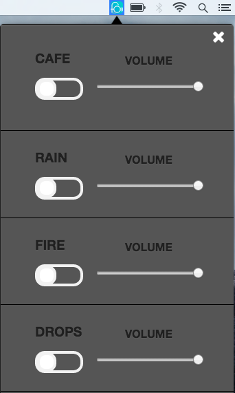

#Foco 

Foco is a cross-platform desktop app :computer: which runs in menubar. 
Foco boosts your productivity :rocket: by creating perfect productive environment.
It has the best sounds for getting work done :raised_hands:.

<br>
[](https://github.com/akashnimare/foco/releases/)

## Installation

Clone the source locally:

```sh
$ git clone https://github.com/akashnimare/foco/
$ cd foco
```
If you're on Debian or Ubuntu, you'll also need to install
`nodejs-legacy`:

Use your package manager to install `npm`.

```sh
$ sudo apt-get install npm nodejs-legacy
```

Install project dependencies:

```sh
$ npm install
```
Start the app:

```sh
$ npm start
```

Build installers  

```sh
$ npm run build
```

## Built with
- [Electron](https://electron.atom.io)
- [Menubar](https://github.com/maxogden/menubar)

## License

MIT - [Akashnimare](http://akashnimare.in)
